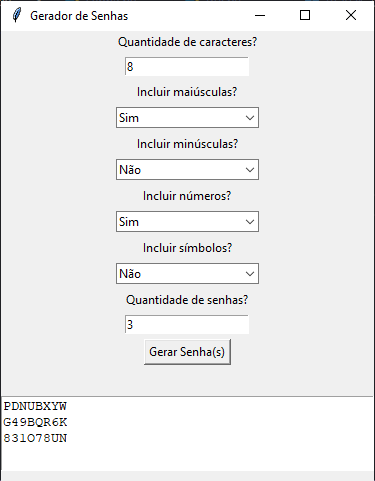

# 🔐 Gerador de Senhas Seguras (com Interface Gráfica)

O **Gerador de Senhas Seguras** é um programa em Python com interface gráfica (Tkinter), desenvolvido para criar senhas aleatórias e fortes, ideais para proteger contas, sistemas e aplicações.

Você pode personalizar o tamanho da senha, escolher se deseja incluir letras maiúsculas, minúsculas, números e símbolos, além de gerar várias senhas de uma vez.

---

## Funcionalidades

- ✅ Interface gráfica intuitiva
- ✅ Escolha da quantidade de caracteres (mínimo 8)
- ✅ Opções de inclusão:
  - Letras maiúsculas
  - Letras minúsculas
  - Números
  - Símbolos
- ✅ Geração de múltiplas senhas simultaneamente
- ✅ Uso da biblioteca **secrets** para maior segurança criptográfica

---

## Como executar

1. Clone este repositório:

```bash
git clone https://github.com/Zeuzinn/gerador-senhas.git
cd gerador-senhas
```

---

## Interface



---

## Tecnologias usadas

- Python 3.x

- Tkinter
 (GUI)

- secrets e string (bibliotecas padrão do Python)

## Estrutura do Projeto
```bash
gerador-senhas/
├── main.py           
├── gui.py            # Interface com Tkinter
├── senha.py          # Lógica de geração de senha
├── utils.py          # Validações auxiliares
└── README.md
```

---